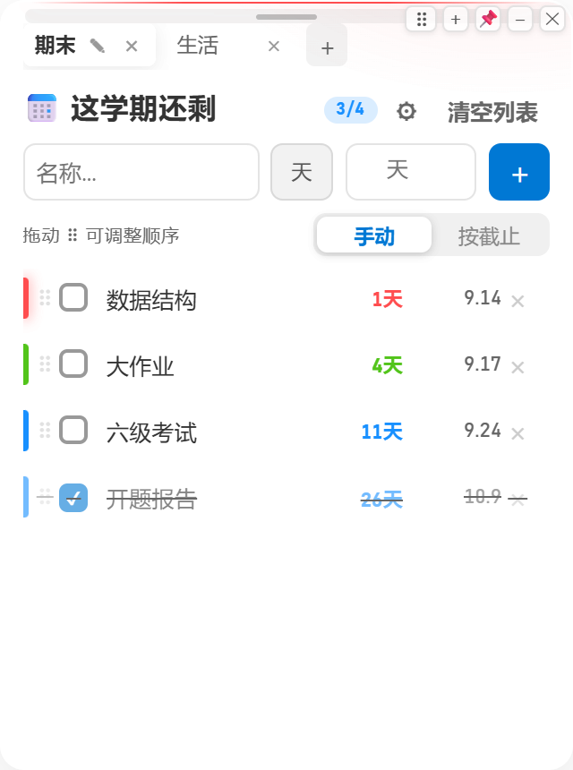
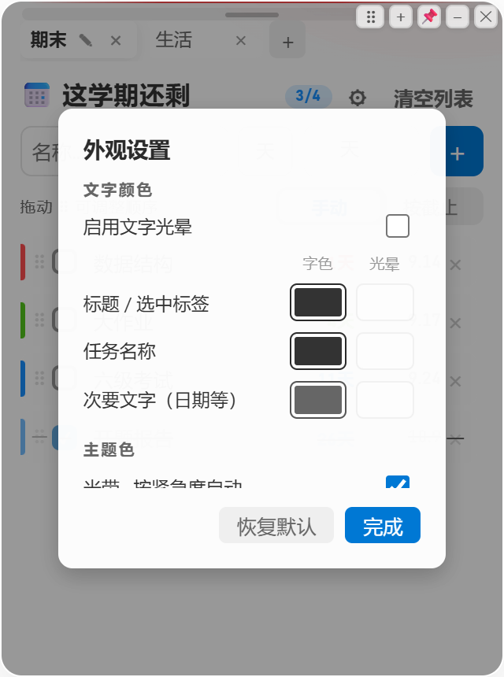

<div align="center">

# NoMoreTomorrow · 桌面便签

把**一个 HTML 文件**包装成 Windows 原生桌面便签：单进程多窗口、独立配置目录、
记住窗口位置/大小/数量（任务管理器强杀、断电、直接关机都不丢）、开机自启。

[](#)
[](#)
[](LICENSE)




</div>

---

## 特性

- **一个进程，多个便签窗口** —— 再次双击 exe 不会再起一个进程，而是让已有进程**再开一个窗口**（单实例锁 + 进程内多窗口）。
- **每个窗口可以显示不同的便签** —— 开两个窗口，一个看「期末」一个看「生活」，互不干扰；任一窗口改内容，其它窗口**实时同步刷新**。
- **窗口位置 / 大小 / 数量全记住** —— 移动缩放 250ms 防抖落盘，关窗 / 退出 / 关机立即落盘。强杀、断电后重启，还是原来那几个窗口、原来的位置和大小。
- **便签内容是文件级持久化** —— 不依赖浏览器 localStorage，改动直接写入 JSON 文件（原子替换），强杀最多丢最后 0.1 秒的输入。
- **独立配置文件夹** —— 便携版存在 exe 旁边，安装版存在 `%APPDATA%\NoMoreTomorrow-Data`，与系统里其它软件完全隔离；备份就是复制一个文件夹。
- **开机自启** —— 首次运行默认开启，托盘菜单随时开关，exe 挪了位置会自动修正路径。
- **透明毛玻璃、无边框** —— 便签直接浮在桌面上，八向缩放、拖动把手、置顶、最小化一应俱全。
- **托盘常驻** —— 新建窗口 / 显示全部 / 置顶 / 开机自启 / 打开配置文件夹。

## 下载

到 **[Releases](../../releases)** 页面下载（仓库里只有源码，不含 exe）。

| 文件 | 适合谁 | 说明 |
|---|---|---|
| `NoMoreTomorrow-Setup-x.y.z.exe` | **推荐** | 安装版：可选安装目录、开始菜单 + 桌面快捷方式、带卸载程序，启动最快 |
| `NoMoreTomorrow-Portable-x.y.z.exe` | 不想安装 | 单文件便携版，数据存在它旁边；每次启动要解压，约 12 秒 |
| `NoMoreTomorrow-绿色版` | 要最快启动 | 解压即用文件夹版，约 1.4 秒启动 |

> 未做数字签名，首次运行 Windows SmartScreen 可能提示 —— 点「更多信息 → 仍要运行」。

## 用法

| 操作 | 方法 |
|---|---|
| 移动窗口 | 拖便签顶部的小把手，或标题那一行的空白处，或右上角 `⠿` |
| 缩放窗口 | 拖窗口四条边 / 四个角 |
| 新建窗口 | 右上角 `＋` / 托盘菜单 / `Ctrl+N` / 再双击一次 exe |
| 置顶 / 最小化 / 关闭 | 右上角 `📌` `–` `✕` |
| 退出软件 | 托盘「退出」，或 `Ctrl+Q`，或关掉最后一个便签窗口 |

数据目录：便携版与绿色版在 exe 同级的 `NoMoreTomorrow-Data\`，安装版在 `%APPDATA%\NoMoreTomorrow-Data\`。
里面 `store.json` 是便签内容，`windows.json` 是窗口布局，删掉整个文件夹即可重置。

## 从源码构建

需要 **Windows + Node 18+ + pnpm**：

```powershell
git clone https://github.com/<you>/NoMoreTomorrow.git
cd NoMoreTomorrow/memo-app

pnpm install
# 若 electron 的二进制没自动下载，手动补一次：
node node_modules\electron\install.js

pnpm start     # 开发调试（直接跑源码）
pnpm dist      # 打包：安装包 + 便携版 + 绿色版，产物在 memo-app\dist
pnpm icons     # 重新生成图标（assets/*.png、build/icon.ico）
```

> `.npmrc` 里已经配好 Electron / electron-builder 的国内镜像；不需要的话删掉即可。
> `pnpm-workspace.yaml` 里有一个 `@electron/get` 的版本覆盖 —— electron-builder 26 声明的是
> `^3` 但代码里用了 4.0+ 才有的 `ElectronDownloadCacheMode`，不覆盖会在下载 NSIS 工具链时崩掉。

## 目录结构

```
NoMoreTomorrow/
├─ Activities.html              # 便签页面本体（唯一数据源，页面的样式与逻辑都在这里）
├─ docs/                        # README 截图
└─ memo-app/                    # Electron 打包工程
   ├─ app/main.js               # 主进程：单实例、多窗口、窗口几何持久化、托盘、自启、文件存储
   ├─ app/preload.js            # 把 localStorage 换成 JSON 文件仓库 + 多窗口实时同步 + 便签绑定
   ├─ app/shell.js              # 注入的窗口外壳：拖动把手、八向缩放热区、右上角窗口按钮
   ├─ app/Activities.html       # 由 `pnpm sync` 从根目录复制进来（生成物，不入库）
   ├─ assets/ build/            # 图标
   └─ scripts/                  # 同步 / 生成图标 / 截图 / 真鼠标回归测试
```

## 实现上值得一看的三个点

**1. 完全不用 `-webkit-app-region`。**
这个页面带 `backdrop-filter` / `isolation` / `z-index:-1` 伪元素，配上透明无边框窗口后，
Chromium 的拖拽区命中判定会失效 —— 表现是**子元素的 `no-drag` 被吃掉，点任何按钮都被当成拖窗口**。
所以移动和缩放都自己实现：renderer 按下 → 主进程用 `screen.getCursorScreenPoint()` 跟随真实光标
`setPosition` / `setBounds`。既不影响点击，也不依赖平台行为。

**2. 数据不再存 localStorage。**
`preload.js` 用 `Object.defineProperty(window, 'localStorage', …)` 把存储整体换成主进程里的 JSON 仓库：
写入 → IPC → 原子落盘（写临时文件再 rename），并广播给其它窗口。多窗口之间靠这个广播实时同步；
键名做了 `xxx::key → key` 归一化，所以改页面标题也不会让便签"消失"。

**3. 窗口状态是"持续写"的，不是"退出时写"。**
`windows.json` 在移动/缩放时防抖写、开窗关窗时立即写、退出前抓一份快照。
退出过程中窗口会被逐个销毁，所以快照必须在 `isQuitting` 置位前抓 —— 否则关机会把窗口数量写成 0
（这个 bug 真出现过，见 commit 历史）。

## 测试

`memo-app/scripts/` 里有一套**真实鼠标**回归脚本（用 `SetCursorPos` + 真实按键事件，而不是 CDP 注入事件）：

```powershell
# 先带调试端口启动（例如绿色版）
.\NoMoreTomorrow.exe --remote-debugging-port=9222

cd memo-app
node scripts\test-ui.mjs 0          # 15 项 UI 点击回归
node scripts\test-drag.mjs 0 "#nt-dragbar" -100 60   # 拖动
node scripts\test-resize.mjs 0 50 40                  # 缩放
node scripts\test-reorder.mjs 0                       # 任务拖拽排序
node scripts\make-screenshots.mjs 0 ../docs           # 重新生成 README 截图
```

> 为什么不用 CDP 注入事件测点击？因为注入事件会**绕过系统层面的拖拽区判定**，
> 上面那个 `-webkit-app-region` 的 bug 就是被这种"假绿"放过去的。

## 许可

[MIT](LICENSE)。发行包内已包含 Electron / Chromium 的许可证文件（`LICENSES.chromium.html`、`LICENSE.electron.txt`）。

---

<details>
<summary>English</summary>

**NoMoreTomorrow** is a Windows desktop sticky-notes app built with Electron around a single HTML file.
One process hosts many note windows; each window can show a different note and they stay in sync in real time.
Window position, size and count are persisted continuously (atomic writes), so a force-kill, power loss or
shutdown without quitting still restores everything on the next launch. Data lives in a dedicated portable
folder next to the exe (or `%APPDATA%` for the installed build), and autostart is enabled on first run.

Download the installers from the Releases page — the repository contains source only.
</details>
